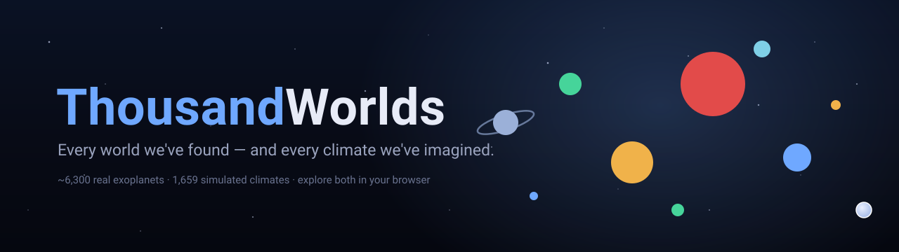

<p align="center">
  
</p>

<h1 align="center">ThousandWorlds Explorer</h1>

<p align="center">
  <b>🔭 Live → <a href="https://thousandworlds-explorer.vercel.app">thousandworlds-explorer.vercel.app</a></b>
</p>

<p align="center">
  An explorable, beginner-friendly map of worlds beyond our Solar System.<br>
  Two datasets, one explorer — switch between them in the top bar.
</p>

---

## The two views

- **🌍 Discovered · NASA** — every confirmed exoplanet humanity has *found* (~6,300), from the
  [NASA Exoplanet Archive](https://exoplanetarchive.ipac.caltech.edu/). Plotted by orbital period and
  size, colored by temperature, with Earth marked for scale. Tour it, filter it, chart it, export CSV.
- **🌡️ Simulated · ThousandWorlds** — 1,659 *simulated* planetary climates from the **ThousandWorlds**
  climate-emulation benchmark. A planet's parameters go in (starlight, air pressure, CO₂…), a global
  climate model computes its climate, and each dot is one run — colored by the resulting surface
  temperature (snowball → temperate → runaway). Take the guided tour, compare the five models, and see
  how the same planet can come out differently.

Three goals in one app: a **beginner-friendly** explorer to learn from, a **shareable** showpiece, and
a **serious analysis tool** over the full catalogs.

## Run locally

```bash
npm install
npm run dev        # → http://localhost:5173
```

That's the whole setup — **no API keys, no backend, no database.** Both datasets ship pre-built in
`public/`, so it works offline after install.

## Refresh the data

```bash
# NASA — pulled live from the Exoplanet Archive TAP API:
curl -sG "https://exoplanetarchive.ipac.caltech.edu/TAP/sync" \
  --data-urlencode "query=select pl_name,hostname,sy_dist,pl_rade,pl_bmasse,pl_dens,pl_eqt,pl_insol,pl_orbper,pl_orbsmax,pl_orbeccen,disc_year,discoverymethod,disc_facility,st_teff,st_rad,st_mass,st_spectype,sy_snum,sy_pnum,ra,dec from pscomppars" \
  --data-urlencode "format=csv" -o data/raw/pscomppars.csv
npm run data       # → public/worlds.json + public/meta.json

# ThousandWorlds — reduce the ~1.6 GB benchmark to area-weighted global means:
python scripts/build-thousandworlds.py --dataset /path/to/ThousandWorlds/dataset --out public
```

## Build & deploy

```bash
npm run build      # tsc + vite build → dist/
```

Fully static (no backend) — host `dist/` anywhere (Vercel, Netlify, Cloudflare Pages, GitHub Pages, or
`npx serve dist`). This repo is connected to Vercel: a push to `main` auto-deploys, or run `vercel --prod`.

## How it's built

- **Vite + React + TypeScript**, no UI framework — a hand-rolled cosmic dark theme.
- Both maps are a single `<canvas>` rendering thousands of points smoothly (offscreen base layer +
  nearest-point hit-testing). All filtering/analysis runs client-side — the datasets are a couple of MB each.
- Shared shell + components across the two tabs (toggle in `src/App.tsx`):
  NASA uses `DiscoveryMap`, `DataTable`, `Charts`, `Sidebar`, `DetailPanel`, `StatBar`, `Tour`;
  ThousandWorlds uses `ThousandWorlds.tsx` (climate phase-diagram, parameter/model filters, per-simulation
  detail, cross-model comparison), reusing `RangeFilter`, `Term`, `Tour`, `Modal`.
- Data pipelines: `scripts/build-data.mjs` (NASA), `scripts/build-thousandworlds.py` (ThousandWorlds).

## Datasets & credits

1. **NASA Exoplanet Archive** (`pscomppars`) — confirmed exoplanets.
2. **ThousandWorlds** — simulated exoplanet climates, used under **CC-BY-4.0** with thanks to its authors.
   This is an independent companion explorer, not an official ThousandWorlds project.

   > Stevenson, Mak, Wolf, Sergeev, Hammond, Mayne & Cranmer (2026),
   > *ThousandWorlds: A benchmark for climate emulation of potentially habitable exoplanets.*
   > [Paper](https://arxiv.org/abs/2606.18338) · [Code](https://github.com/astroautomata/ThousandWorlds)
   > · [DOI](https://doi.org/10.57967/hf/8695)

## Data notes

- NASA `esi` is a *rough* Earth-likeness (0–1) from size and equilibrium temperature only — a transparent
  heuristic, **not** a habitability claim. `hz` flags a temperate, Earth-size band (a beginner shorthand).
- ThousandWorlds values are **area-weighted global means** of time-averaged climate-model output —
  simulations, not observations, and not habitability claims.
- Missing fields are stored as `null` and excluded from views that need them.

<p align="center"><sub>Code: MIT · ThousandWorlds data: CC-BY-4.0 · NASA Exoplanet Archive</sub></p>
