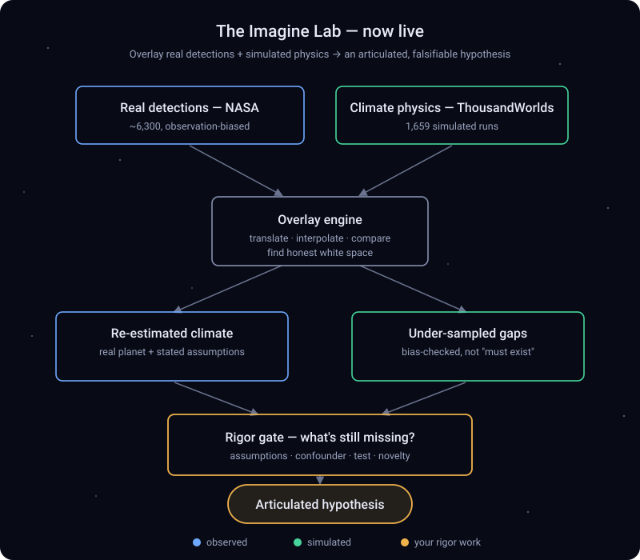

<p align="center">
  
</p>

<h1 align="center">ThousandWorlds Explorer</h1>

<p align="center">
  <b>🔭 Live → <a href="https://thousandworlds-explorer.vercel.app">thousandworlds-explorer.vercel.app</a></b>
</p>

<p align="center">
  An explorable, beginner-friendly map of worlds beyond our Solar System.<br>
  Two datasets, one explorer — switch between them in the top bar.
</p>

<p align="center">
  Built on and inspired by the <a href="https://github.com/astroautomata/ThousandWorlds"><b>ThousandWorlds</b></a>
  climate-emulation benchmark (Stevenson, Cranmer et al.) —
  <a href="https://arxiv.org/abs/2606.18338">paper</a> ·
  <a href="https://github.com/astroautomata/ThousandWorlds">code</a> ·
  <a href="https://doi.org/10.57967/hf/8695">dataset</a>.<br>
  <sub>An independent companion explorer, with thanks to its authors — simulation data used under CC&#8209;BY&#8209;4.0.</sub>
</p>

---

## The two views

- **🌍 Discovered · NASA** — every confirmed exoplanet humanity has *found* (~6,300), from the
  [NASA Exoplanet Archive](https://exoplanetarchive.ipac.caltech.edu/). Plotted by orbital period and
  size, colored by temperature, with Earth marked for scale. Tour it, filter it, chart it, export CSV.
- **🌡️ Simulated · ThousandWorlds** — 1,659 *simulated* planetary climates from the **ThousandWorlds**
  climate-emulation benchmark. A planet's parameters go in (starlight, air pressure, CO₂…), a global
  climate model computes its climate, and each dot is one run — colored by the resulting surface
  temperature (snowball → temperate → runaway). Take the guided tour, compare the five models, and see
  how the same planet can come out differently.

Three goals in one app: a **beginner-friendly** explorer to learn from, a **shareable** showpiece, and
a **serious analysis tool** over the full catalogs.

## Where this is heading

Today it's two datasets side by side. The aim is a **playground for explorers** — a place to
**overlay different datasets and test your own theories and equations** against these climate models:
re-estimate a real discovered planet's climate using the simulators, probe under-sampled corners of
parameter space, and turn a hunch into a clearly-articulated, *falsifiable* hypothesis. Honest framing
throughout — these are simulations and global means, never habitability claims. Built in the open, in
the spirit of the ThousandWorlds benchmark it stands on.

## The playground — Imagine · Lab

<p align="center">
  
</p>

A third tab, **Imagine · Lab**, is **live** — an *honest hypothesis forge* that overlays the two
datasets so you can test your own theories:

- **Overlay & translate** — pick any of the ~5,700 real discovered planets that fall inside the
  simulated range, assume an atmosphere (surface pressure + CO₂), and the climate models
  **re-estimate its surface temperature** from its 12 nearest simulated analogs — a more physical
  guess than the crude equilibrium temperature. The estimate *moves with your assumption* (that
  honesty is the point), and it flags when a planet falls outside the simulated grid (extrapolation).
- **Test your own equations** — write a formula over the real catalog (e.g. `esi / sqrt(dist)` for
  "Earth-like *and* nearby") and rank planets by *your* idea of what matters, then click a result to
  translate it. Runs through a tiny safe expression evaluator — no `eval`.
- **Forge a hypothesis** — a *rigor gate* turns a hunch into a clearly-stated, falsifiable hypothesis:
  it auto-fills the data + your assumptions, scores it against 8 rigor checks (a clear claim, a
  physical mechanism, confounders, a falsifiable test, novelty, in-envelope…), lists the gaps still to
  close, and hands you a copyable hypothesis card.

Playful to poke at, strict about what counts as a finding — and honest throughout: it re-estimates
*simulated analogies*, never observations or habitability claims, and points at *places worth a closer
look*, never "planets that must exist."

## See it — or run your own copy

**Most people don't need to install anything.** The whole explorer runs in your browser:

### 👉 [thousandworlds-explorer.vercel.app](https://thousandworlds-explorer.vercel.app)

Open that link and you're done — that's the full experience. The steps below are *only* if you'd like
to run your own local copy.

<details open>
<summary><b>Run it on your own computer — step by step (~5 minutes, no experience needed)</b></summary>

<br>

You'll need a **terminal** (the *Terminal* app on macOS, *PowerShell* on Windows) and **Node.js**.

1. **Install Node.js.** Go to **[nodejs.org](https://nodejs.org)**, download the **LTS** version, and run
   the installer (it bundles `npm`, used below). To check it worked, open your terminal and type
   `node -v` — you should see a version like `v20.x`.
2. **Get the code.** On the **[repo page](https://github.com/hamza-ali-shahjahan/thousandworlds-explorer)**,
   click the green **`Code`** button → **Download ZIP**, then unzip it.
   *(Prefer git? `git clone https://github.com/hamza-ali-shahjahan/thousandworlds-explorer.git`)*
3. **Open that folder in your terminal.** Type `cd ` (with a trailing space), drag the unzipped folder
   onto the terminal window, and press **Enter**. Your prompt should now show the folder's name.
4. **Install the dependencies** — one time, downloads what the app needs (takes a minute):
   ```bash
   npm install
   ```
5. **Start it up:**
   ```bash
   npm run dev
   ```
   It prints a local link — usually **http://localhost:5173**.
6. **Open that link in your browser.** You should see the explorer. 🎉 (To stop it later, press
   **`Ctrl + C`** in the terminal.)

**If it doesn't work:** `npm: command not found` (or `node: command not found`) means Node.js isn't
installed yet — redo step 1 and restart your terminal. Everything runs on your own machine: **no
account, no API keys, no database, no big download, and no data leaves your computer.** Both datasets
ship pre-built, so it even works offline after install.

</details>

## Refresh the data

> **You don't need any of this to run the explorer.** Both datasets ship pre-built in `public/` (a
> ~384 KB ThousandWorlds slice + the NASA JSON). This section is only for *regenerating* them from source.

```bash
# NASA — pulled live from the Exoplanet Archive TAP API:
curl -sG "https://exoplanetarchive.ipac.caltech.edu/TAP/sync" \
  --data-urlencode "query=select pl_name,hostname,sy_dist,pl_rade,pl_bmasse,pl_dens,pl_eqt,pl_insol,pl_orbper,pl_orbsmax,pl_orbeccen,disc_year,discoverymethod,disc_facility,st_teff,st_rad,st_mass,st_spectype,sy_snum,sy_pnum,ra,dec from pscomppars" \
  --data-urlencode "format=csv" -o data/raw/pscomppars.csv
npm run data       # → public/worlds.json + public/meta.json

# ThousandWorlds — reduce the benchmark to area-weighted global means:
python scripts/build-thousandworlds.py --dataset /path/to/ThousandWorlds/dataset --out public
```

### Rebuilding the ThousandWorlds slice — what you'll need

The browser slice (`public/thousandworlds.json`, ~384 KB) is distilled from the **full benchmark
dataset, which is _not_ in this repo** (it's hosted by the ThousandWorlds team on Hugging Face). To
regenerate it you'll need:

| Requirement | Detail |
|---|---|
| **Disk** | **≈ 1.6 GB** for the source dataset (gridded climate fields across the 5 GCMs) |
| **RAM** | **~4 GB free** — the reducer loads the gridded field array (sims × 48 fields × 32 × 64 grid) into memory |
| **Python** | **3.10+**, with `numpy` |
| **Time** | a couple of minutes, once the data is local |

Get the source dataset from Hugging Face, then run the reducer:

```bash
pip install thousandworlds
python -c "import thousandworlds as tw; tw.download_dataset(data_dir='dataset')"   # ~1.6 GB
python scripts/build-thousandworlds.py --dataset ./dataset --out public
```

The script reads `inputs.csv` + the complete-observation field arrays and writes one row per
simulation of **area-weighted global means** (surface temperature, absorbed/outgoing radiation, cloud
fraction) — the small, honest summary the browser plots.

## Build & deploy

```bash
npm run build      # tsc + vite build → dist/
```

Fully static (no backend) — host `dist/` anywhere (Vercel, Netlify, Cloudflare Pages, GitHub Pages, or
`npx serve dist`). This repo is connected to Vercel: a push to `main` auto-deploys, or run `vercel --prod`.

## How it's built

- **Vite + React + TypeScript**, no UI framework — a hand-rolled cosmic dark theme.
- Both maps are a single `<canvas>` rendering thousands of points smoothly (offscreen base layer +
  nearest-point hit-testing). All filtering/analysis runs client-side — the datasets are a couple of MB each.
- Shared shell + components across the two tabs (toggle in `src/App.tsx`):
  NASA uses `DiscoveryMap`, `DataTable`, `Charts`, `Sidebar`, `DetailPanel`, `StatBar`, `Tour`;
  ThousandWorlds uses `ThousandWorlds.tsx` (climate phase-diagram, parameter/model filters, per-simulation
  detail, cross-model comparison), reusing `RangeFilter`, `Term`, `Tour`, `Modal`.
- Data pipelines: `scripts/build-data.mjs` (NASA), `scripts/build-thousandworlds.py` (ThousandWorlds).

## Datasets & credits

This explorer stands on two open datasets. Credit where it's due.

### ThousandWorlds — the simulated climates

The heart of the Simulated tab: a benchmark of **1,760 climate simulations across 5 GCMs and 8 planet
parameters** by **Stevenson, Mak, Wolf, Sergeev, Hammond, Mayne & Cranmer (2026)**, used here under
**CC-BY-4.0** with thanks to its authors. This is an **independent companion explorer, not an official
ThousandWorlds project** — it grew out of [contributing a
baseline](https://github.com/astroautomata/ThousandWorlds/pull/1) to the benchmark.

- 📄 **Paper** — https://arxiv.org/abs/2606.18338
- 💻 **Code** — https://github.com/astroautomata/ThousandWorlds
- 🤗 **Dataset** (Hugging Face) — https://doi.org/10.57967/hf/8695

<details>
<summary>Citation (BibTeX)</summary>

```bibtex
@article{thousandworlds2026,
  title  = {ThousandWorlds: A benchmark for climate emulation of potentially habitable exoplanets},
  author = {Stevenson, Edward T. and Mak, Mei Ting and Wolf, Eric and Sergeev, Denis E. and Hammond, Tobi and Mayne, N. J. and Cranmer, Miles},
  year   = {2026},
  eprint = {2606.18338},
  archivePrefix = {arXiv},
  doi    = {10.48550/arXiv.2606.18338}
}
```
</details>

### NASA Exoplanet Archive — the discovered planets

The Discovered tab uses the `pscomppars` table of confirmed exoplanets from the
[NASA Exoplanet Archive](https://exoplanetarchive.ipac.caltech.edu/), operated by Caltech/IPAC under
contract with NASA.

## Data notes

- NASA `esi` is a *rough* Earth-likeness (0–1) from size and equilibrium temperature only — a transparent
  heuristic, **not** a habitability claim. `hz` flags a temperate, Earth-size band (a beginner shorthand).
- ThousandWorlds values are **area-weighted global means** of time-averaged climate-model output —
  simulations, not observations, and not habitability claims.
- Missing fields are stored as `null` and excluded from views that need them.

<p align="center"><sub>Code: MIT · ThousandWorlds data: CC-BY-4.0 · NASA Exoplanet Archive</sub></p>
