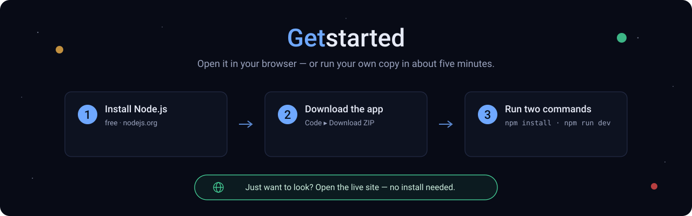

<p align="center">
  
</p>

<h1 align="center">ThousandWorlds Explorer</h1>

<p align="center">
  <b>🔭 Live → <a href="https://thousandworldsexplorer.com">thousandworldsexplorer.com</a></b>
</p>

<p align="center">
  An explorable, beginner-friendly map of worlds beyond our Solar System.<br>
  Two datasets, three tabs — switch between them in the top bar.
</p>

<p align="center">
  Built on and inspired by the <a href="https://github.com/astroautomata/ThousandWorlds"><b>ThousandWorlds</b></a>
  climate-emulation benchmark (Stevenson, Cranmer et al.) —
  <a href="https://arxiv.org/abs/2606.18338">paper</a> ·
  <a href="https://github.com/astroautomata/ThousandWorlds">code</a> ·
  <a href="https://doi.org/10.57967/hf/8695">dataset</a>.<br>
  <sub>An independent companion explorer, with thanks to its authors — simulation data used under CC&#8209;BY&#8209;4.0.</sub>
</p>

---

## The two views

- **🌍 Discovered · NASA** — every confirmed exoplanet humanity has *found* (~6,300), from the
  [NASA Exoplanet Archive](https://exoplanetarchive.ipac.caltech.edu/). Plotted by orbital period and
  size, colored by temperature, with Earth marked for scale. Tour it, filter it, chart it, export CSV.
- **🌡️ Simulated · ThousandWorlds** — 1,659 *simulated* planetary climates from the **ThousandWorlds**
  climate-emulation benchmark (its `multi-complete` subset — the 1,760-run full set includes partial
  records; [dataset notes](https://github.com/astroautomata/ThousandWorlds/blob/main/dataset/README.md)).
  A planet's parameters go in (starlight, air pressure, CO₂…), a global
  climate model computes its climate, and each dot is one run — colored by the resulting surface
  temperature (snowball → temperate → scorching). Take the guided tour, compare the five models, and see
  how the same planet can come out differently. Click a world to watch its actual simulated
  **surface-temperature map** bloom out of the dot.

Three goals in one app: a **beginner-friendly** explorer to learn from, a **shareable** showpiece, and
a **serious analysis tool** over the full catalogs.

## Where this is heading

Today it's two datasets side by side. The aim is a **playground for explorers** — a place to
**overlay different datasets and test your own theories and equations** against these climate models:
re-estimate a real discovered planet's climate using the simulators, probe under-sampled corners of
parameter space, and turn a hunch into a clearly-articulated, *falsifiable* hypothesis. Honest framing
throughout — these are simulations and global means, never habitability claims. Built in the open, in
the spirit of the ThousandWorlds benchmark it stands on.

A full **interactive climate-emulator demo** (8 parameters in → predicted spatial climate fields out,
across projections, energy maps and winds) is live in **private preview** for the benchmark's authors,
and lands publicly when their flagship emulator ships.

## The playground — Imagine · Lab

<p align="center">
  
</p>

A third tab, **Imagine · Lab**, is **live** — an *honest hypothesis forge* that overlays the two
datasets so you can test your own theories:

- **Overlay & translate** — pick any of the ~5,700 real discovered planets that fall inside the
  simulated range, assume an atmosphere (surface pressure + CO₂), and the climate models
  **re-estimate its surface temperature** from its 12 nearest simulated analogs — a more physical
  guess than the crude equilibrium temperature. The estimate *moves with your assumption* (that
  honesty is the point), and it flags when a planet falls outside the simulated grid (extrapolation).
- **Test your own equations** — write a formula over the real catalog (e.g. `esi / sqrt(dist)` for
  "Earth-like *and* nearby") and rank planets by *your* idea of what matters, then click a result to
  translate it. Runs through a tiny safe expression evaluator — no `eval`.
- **Build a world** — set a world's starlight, star, pressure, CO₂, size and gravity with sliders and
  watch a **client-side PCA-GBT emulator** (a real baseline from the benchmark, running as ONNX in your
  browser) predict its spatial climate map with an honest uncertainty band — then *meet its real
  cousin* in the NASA catalog.
- **Test a hunch** — assemble a claim from dropdowns (no typing), test it against the 1,659
  simulations, and get an honest verdict — Supported / Mixed / Not supported — with the matching
  distribution and a shareable finding card.

Playful to poke at, strict about what counts as a finding — and honest throughout: it re-estimates
*simulated analogies*, never observations or habitability claims, and points at *places worth a closer
look*, never "planets that must exist."

## Get started

<p align="center">
  
</p>

**Just want to look around?** You don't need to install anything — open the live site:

### 👉 [thousandworldsexplorer.com](https://thousandworldsexplorer.com)

That's the full experience, right in your browser.

<details open>
<summary><b>Want to run your own copy? Here's how — plain and simple (~5 minutes)</b></summary>

<br>

You'll do this in a **terminal** — the *Terminal* app on a Mac, or *PowerShell* on Windows. Don't worry,
you'll only type two short lines.

1. **Install Node.js (it's free).** Go to **[nodejs.org](https://nodejs.org)**, click the big green
   **LTS** download button, and run the installer. This is the only thing you need to install.
2. **Download the app.** On the **[project page](https://github.com/hamza-ali-shahjahan/thousandworlds-explorer)**,
   click the green **`Code`** button, choose **Download ZIP**, and unzip the file you get.
3. **Open that folder in your terminal.** Type `cd`, then a space, then drag the unzipped folder onto the
   terminal window, and press **Enter**.
4. **Set it up.** Type this and press **Enter** (it runs for about a minute):
   ```bash
   npm install
   ```
5. **Start it.** Type this and press **Enter**:
   ```bash
   npm run dev
   ```
6. **Open it.** The terminal prints a link — usually **http://localhost:5173**. Open it in your browser. 🎉

To stop it later, click the terminal and press **Ctrl + C**.

**If you get stuck:** if a step says `npm: command not found`, Node.js isn't installed yet — do step 1
again and reopen your terminal. Everything runs on your own computer: no account, no keys, and nothing
ever leaves your machine.

</details>

## Accounts, sharing & privacy

The hosted site has **optional accounts** (magic link or Google) for saving and sharing the worlds and
findings you make — browsing needs no account at all. Self-hosted copies run fully anonymously with no
keys; to enable accounts on your own copy see [docs/accounts-setup.md](docs/accounts-setup.md).

Usage measurement is **first-party and anonymous only** (a pageview, tab switches, client errors — no
IP, no fingerprint, no third-party trackers, Do-Not-Track respected). Details:
[privacy](https://thousandworldsexplorer.com/privacy) · [terms](https://thousandworldsexplorer.com/terms).

## Refresh the data

> **You don't need any of this to run the explorer.** Both datasets ship pre-built in `public/` (a
> ~384 KB ThousandWorlds slice + the NASA JSON). This section is only for *regenerating* them from source.

> **The NASA data refreshes itself weekly:** a [GitHub Action](.github/workflows/data-refresh.yml)
> pulls the archive every Monday, validates the result (schema, coverage, row-count sanity —
> `scripts/validate-data.mjs`), and opens an auto-merging PR. The site footer shows the live
> "data as of" date.

```bash
# NASA — pulled live from the Exoplanet Archive TAP API:
curl -sG "https://exoplanetarchive.ipac.caltech.edu/TAP/sync" \
  --data-urlencode "query=select pl_name,hostname,sy_dist,pl_rade,pl_bmasse,pl_dens,pl_eqt,pl_insol,pl_orbper,pl_orbsmax,pl_orbeccen,disc_year,discoverymethod,disc_facility,st_teff,st_rad,st_mass,st_spectype,sy_snum,sy_pnum,ra,dec from pscomppars" \
  --data-urlencode "format=csv" -o data/raw/pscomppars.csv
npm run data       # → public/worlds.json + public/meta.json

# ThousandWorlds — reduce the benchmark to area-weighted global means:
python scripts/build-thousandworlds.py --dataset /path/to/ThousandWorlds/dataset --out public
```

### Rebuilding the ThousandWorlds slice — what you'll need

The browser slice (`public/thousandworlds.json`, ~384 KB) is distilled from the **full benchmark
dataset, which is _not_ in this repo** (it's hosted by the ThousandWorlds team on Hugging Face). To
regenerate it you'll need:

| Requirement | Detail |
|---|---|
| **Disk** | **≈ 1.6 GB** for the source dataset (gridded climate fields across the 5 GCMs) |
| **RAM** | **~4 GB free** — the reducer loads the gridded field array (sims × 48 fields × 32 × 64 grid) into memory |
| **Python** | **3.10+**, with `numpy` |
| **Time** | a couple of minutes, once the data is local |

Get the source dataset from Hugging Face, then run the reducer:

```bash
pip install thousandworlds
python -c "import thousandworlds as tw; tw.download_dataset(data_dir='dataset')"   # ~1.6 GB
python scripts/build-thousandworlds.py --dataset ./dataset --out public
```

The script reads `inputs.csv` + the complete-observation field arrays and writes one row per
simulation of **area-weighted global means** (surface temperature, absorbed/outgoing radiation, cloud
fraction) — the small, honest summary the browser plots.

## Build & deploy

```bash
npm run build      # tsc + vite build → dist/
```

Fully static (no backend) — host `dist/` anywhere (Vercel, Netlify, Cloudflare Pages, GitHub Pages, or
`npx serve dist`). This repo is connected to Vercel: a push to `main` auto-deploys, or run `vercel --prod`.

## How it's built

- **Vite + React + TypeScript**, no UI framework — a hand-rolled cosmic dark theme.
- Both maps are a single `<canvas>` rendering thousands of points smoothly (offscreen base layer +
  nearest-point hit-testing). All filtering/analysis runs client-side — the datasets are a couple of MB each.
- Shared shell + components across the two tabs (toggle in `src/App.tsx`):
  NASA uses `DiscoveryMap`, `DataTable`, `Charts`, `Sidebar`, `DetailPanel`, `StatBar`, `Tour`;
  ThousandWorlds uses `ThousandWorlds.tsx` (climate phase-diagram, parameter/model filters, per-simulation
  detail, cross-model comparison), reusing `RangeFilter`, `Term`, `Tour`, `Modal`.
- Data pipelines: `scripts/build-data.mjs` (NASA), `scripts/build-thousandworlds.py` (ThousandWorlds).

## Datasets & credits

This explorer stands on two open datasets. Credit where it's due.

### ThousandWorlds — the simulated climates

The heart of the Simulated tab: a benchmark of **1,760 climate simulations across 5 GCMs and 8 planet
parameters** by **Stevenson, Mak, Wolf, Sergeev, Hammond, Mayne & Cranmer (2026)**, used here under
**CC-BY-4.0** with thanks to its authors. This is an **independent companion explorer, not an official
ThousandWorlds project** — it grew out of [contributing a
baseline](https://github.com/astroautomata/ThousandWorlds/pull/1) to the benchmark.

- 📄 **Paper** — https://arxiv.org/abs/2606.18338
- 💻 **Code** — https://github.com/astroautomata/ThousandWorlds
- 🤗 **Dataset** (Hugging Face) — https://doi.org/10.57967/hf/8695

<details>
<summary>Citation (BibTeX)</summary>

```bibtex
@article{thousandworlds2026,
  title  = {ThousandWorlds: A benchmark for climate emulation of potentially habitable exoplanets},
  author = {Stevenson, Edward T. and Mak, Mei Ting and Wolf, Eric and Sergeev, Denis E. and Hammond, Tobi and Mayne, N. J. and Cranmer, Miles},
  year   = {2026},
  eprint = {2606.18338},
  archivePrefix = {arXiv},
  doi    = {10.48550/arXiv.2606.18338}
}
```
</details>

### NASA Exoplanet Archive — the discovered planets

The Discovered tab uses the `pscomppars` table of confirmed exoplanets from the
[NASA Exoplanet Archive](https://exoplanetarchive.ipac.caltech.edu/), operated by Caltech/IPAC under
contract with NASA.

## Data notes

- NASA `esi` is a *rough* Earth-likeness (0–1) from size and equilibrium temperature only — a transparent
  heuristic, **not** a habitability claim. `hz` flags a temperate, Earth-size band (a beginner shorthand).
- ThousandWorlds values are **area-weighted global means** of time-averaged climate-model output —
  simulations, not observations, and not habitability claims.
- Missing fields are stored as `null` and excluded from views that need them.

<p align="center"><sub>Code: MIT · ThousandWorlds data: CC-BY-4.0 · NASA Exoplanet Archive</sub></p>
